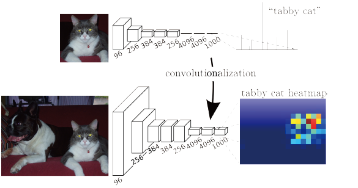
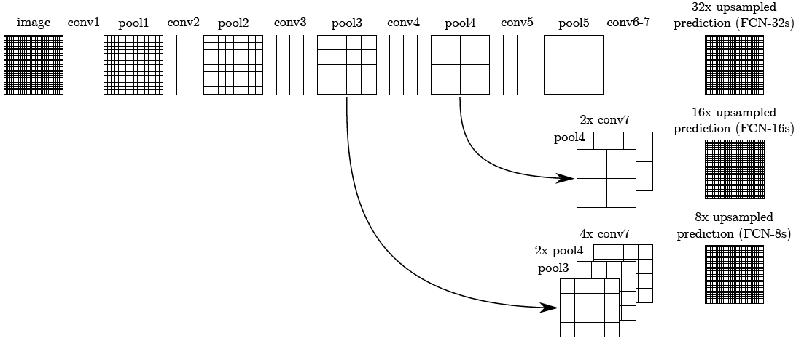
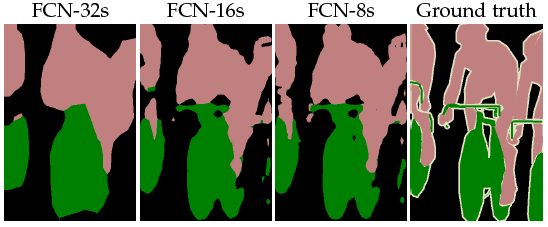
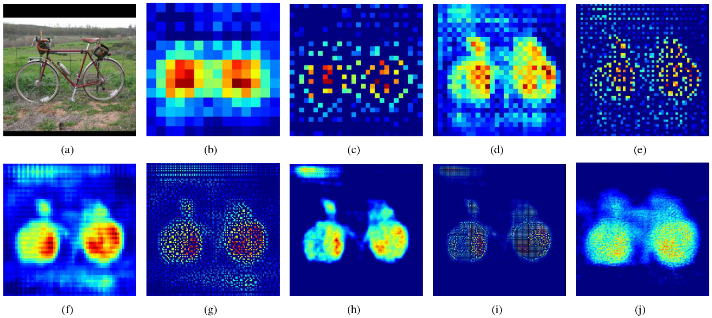

# Semantic Segmentation, Papers and Insights

1. FCN, Fully Convolutional Networks for Semantic Segmentation [[pdf](https://www.cv-foundation.org/openaccess/content_cvpr_2015/papers/Long_Fully_Convolutional_Networks_2015_CVPR_paper.pdf)][[code](https://github.com/shelhamer/fcn.berkeleyvision.org)]

>Long, Jonathan, Evan Shelhamer, and Trevor Darrell. "Fully convolutional networks for semantic segmentation." Proceedings of the IEEE conference on computer vision and pattern recognition. 2015.

Insights:

* Treat fully connected layer as convolutional layer, so as to accept an image in random resolution as input to the network.
* Interleave the processes of feature combination and upscaling, in order to improve spatial detail.

Details:

* Use pretrained VGG-16 nets.
* Feature concatenation + 1x1 convolution = 1x1 convolution + feature addition, yet right side has small memory usage.
* No significant difference in accuracy between fixed bilinear upsampling kernel and learned deconvolutional kernel.

2. DeconvNet, Learning Deconvolution Network for Semantic Segmentation [[pdf](https://www.cv-foundation.org/openaccess/content_iccv_2015/papers/Noh_Learning_Deconvolution_Network_ICCV_2015_paper.pdf)][[code](https://github.com/HyeonwooNoh/DeconvNet)]

>Noh, Hyeonwoo, Seunghoon Hong, and Bohyung Han. "Learning deconvolution network for semantic segmentation." Proceedings of the IEEE international conference on computer vision. 2015.

Insights:

* Upsample feature map by unpooling (reverse pooling with recorded pooling indices), then refine the spatial info by deconvolution. Although deconv can enlarge the spatial size in a straightforward way, the authors found out that unpooling can recover the general shape, wherease deconv can recover the class-specific shape, and disentangling the recovery of general shape and class-specific shape can boost the performance. (However, the corresponding ablation study is not found in the paper)
* Segment multiple crops of the image with respect to the region proposals, then fuse the score maps (maximum or average).

Details:

* Two-stage training, with easy examples first challenging ones later. Easy examples are image regions cropped with exact annotations, while challenging ones are image regions cropped with sampled bounding boxes and filtered by IoU > 0.5 with annotations.